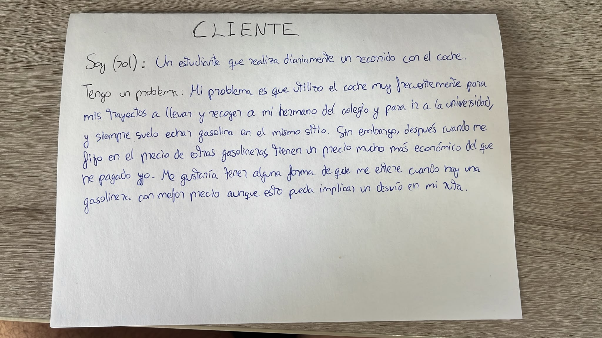

# RepartoHogar

## Descripción del problema

Últimamente noto que mis padres empiezan a notar el peso de los años, pero sobretodo pienso que a mi madre cada vez le cuesta más lidiar con las tareas de casa, que asume prácticamente todas. Creo que necesitamos una forma de que nos podamos repartir las tareas de forma justa entre todos, ya que algunas tareas no exigen el mismo esfuerzo que otras, y a ser posible que cada cierto tiempo cambie la distribución para que no le toquen siempre las mismas tareas a la misma persona.

